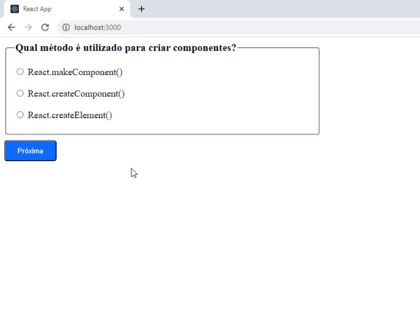

# 💻 QUESTIONÁRIO REACT

---

## 🗒️ Sobre o projeto

Uma aplicação com um questionário de 4 perguntas sobre ReactJS. 
As perguntas estão armazenadas numa array com suas opções e reposta correta. As respostas do usuário são armazenadas num estado, dentro de um objeto 
que é criado através de um reduce, usando como referência o id das perguntas, isso otimiza a criação das repostas, digitando menos código, 
bastando apenas adicionar novas perguntas com suas opções e resposta correta no Array. Há também um estado slide para exibir uma pergunta por vez. No final é exibido 
quantos foram os acertos em relação ao total de perguntas.

---

## 🛠 Tecnologias

### Frontend:

-   HTML
-   CSS
-   JavaScript
-   ReactJS

---

## 🎨 Screens

### Web

  

